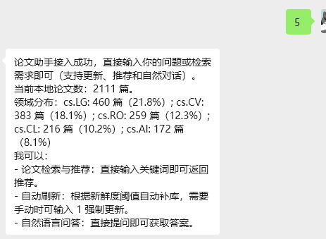
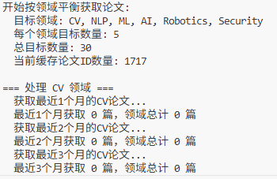
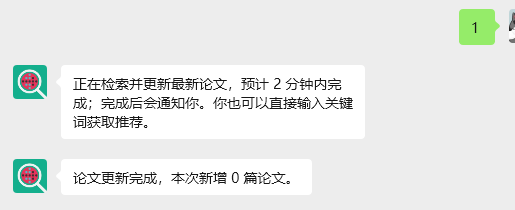
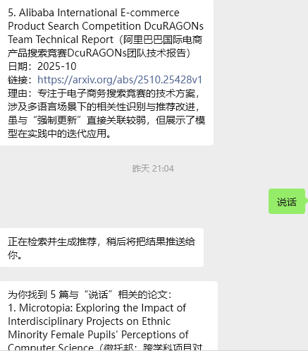
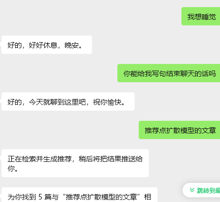
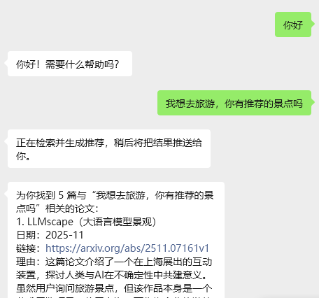
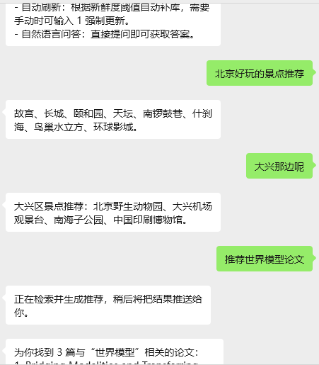
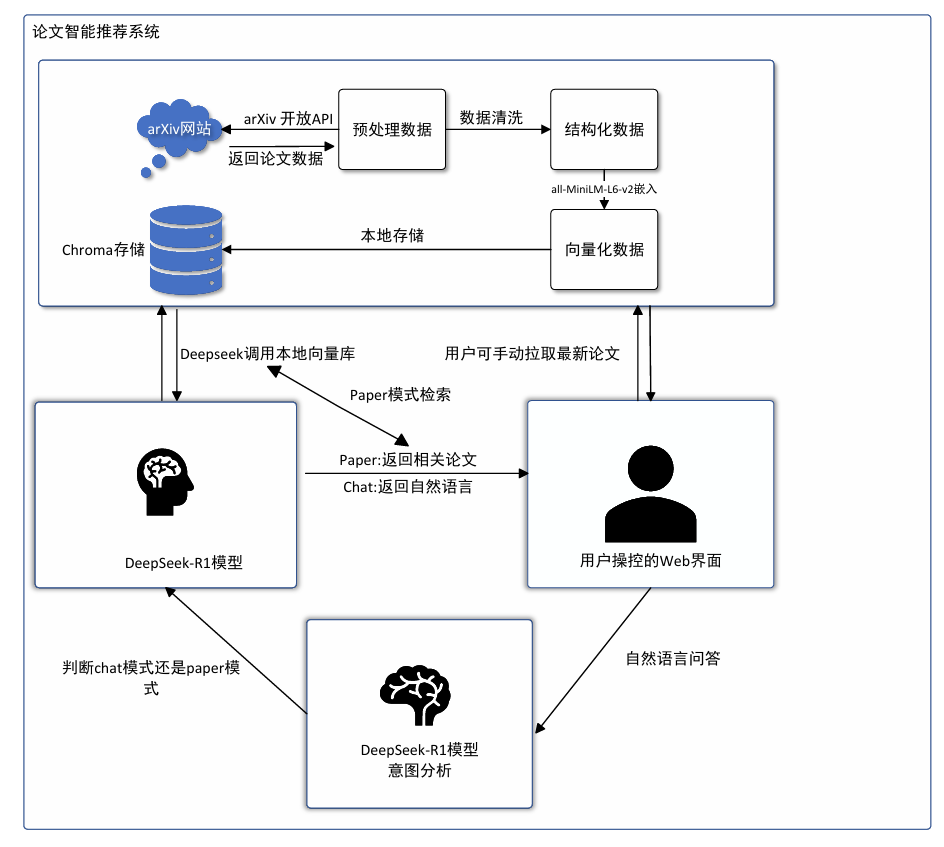
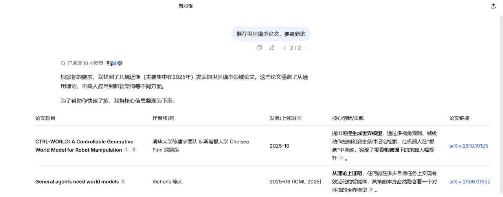
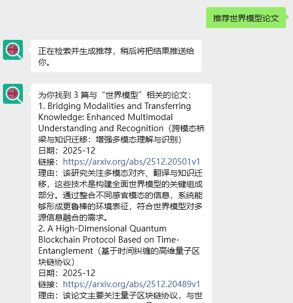

刘尊阳-2025140899

我做的agent叫做论文智能推荐系统。思路是给予大模型一个工具，通过此工具调用arxiv上的论文，向量化后保存在本地。之后调用deepseek-R1模型，模型不仅可以自然语言问答，当分析到用户有想要看论文的倾向时，会查阅本地向量库返回论文推荐的结果。

下面我将逐一介绍代码中涉及到的模块

## ①arxiv论文调用工具-更新，向量化以及查阅

arxiv上每天都更新成百上千的论文，arxiv平台给予了api调用获取论文的方式。这里我通过arxiv开放api进行了论文获取。但是这其中藏着几个大坑。我也尝试用gpt进行更正，结果它改不对，只能自己下场修bug了

一般来说，使用get方法获取arxiv论文的url如下：

`https://export.arxiv.org/api/query?search_query=cat%3Acs.AI+OR+cat%3Acs.LG+OR+cat%3Acs.CV&id_list=&sortBy=submittedDate&sortOrder=descending&start=0&max_results=1000`

各个参数的作用：

`search_query`：查询领域，后面的`cs.AI`，`cs.LG`,`cs.CV`等分别表示人工智能，机器学习和计算机视觉

`id_list=`：通过论文id进行指定查询，这个可以不指定

`sortBy=submittedDate`：表示根据提交日期进行查询

`sortOrder=descending`：表示倒序查询

`start=0`：表示从返回结果中的第0条开始返回

`max_results=1000`：表示最多返回1000条

即使设定max\_result值为1000，那也不一定会返回1000条；经过测试，只会返回400条左右（浏览器测试）；

但是只要将领域进行细分，不再是单一领域，则可能会返回1000条。经过测试，也不准确。有时即使细分了领域，加起来可能也只有400-500篇。那么要怎么办呢？需要设定时间字段。这时代码会尝试拉取最近一个月的论文，如果不够1000篇，则逐步扩大时间范围，直到拉取到1000篇或无更多数据为止。

在拉取过程中，还要防止由于领域重叠，拉取到了重复的论文。代码如下：

```python
def _refresh_knowledge_base(domains: Optional[List[str]] = None, target_count: Optional[int] = None) -> Tuple[int, int]:
    kb_obj, _ = ensure_initialized()
    domains = domains or fetcher.get_available_domains()
    if not domains:
        raise ValueError("domains list is empty")
    target = target_count if target_count is not None else min(ARXIV_MAX_PER_CALL, 30)
    target = min(target, ARXIV_MAX_PER_CALL)
    papers_per_domain = max(1, target // len(domains))
    new_papers = fetcher.fetch_balanced_papers(
        domains=domains, papers_per_domain=papers_per_domain, target_count=target
    )
    inserted = kb_obj.add_papers(new_papers)
    _record_refresh_time()
    return inserted, len(new_papers)
def add_papers(self, papers: List[Dict[str, Any]]) -> int:
    if not papers:
        return 0
    new_docs = []
    new_metas = []
    new_ids = []
    for p in papers:
        pid = p.get("id")
        if not pid:
            continue
        if pid in self.existing_ids:
            continue
        abstract = p.get("abstract", "") or ""
        # 使用完整摘要提升召回质量，就是使用完整摘要
        doc = f"Title: {p.get('title','')}\nAbstract: {abstract}"
        new_docs.append(doc)
        new_metas.append(
            {
                "title": p.get("title"),
                "authors": ", ".join(p.get("authors", [])),
                "published": p.get("published"),
                "primary_category": p.get("primary_category"),
                "pdf_url": p.get("pdf_url"),
                "arxiv_url": p.get("arxiv_url"),
            }
        )
        new_ids.append(pid)
    if not new_ids:
        return 0
    embeddings = self.embedding_model.encode(new_docs, show_progress_bar=False, convert_to_numpy=True)
    self.collection.add(
        documents=new_docs,
        metadatas=new_metas,
        ids=new_ids,
        embeddings=embeddings.tolist(),
    )
    self.existing_ids.update(new_ids)
    self.total_count += len(new_ids)
    for meta in new_metas:
        cat = meta.get("primary_category")
        if cat:
            self.category_counts[cat] += 1
    return len(new_ids)
```

需要`get_paper.py`（实现了主要的均分领域进行拉取，数量不够向前检索补充论文功能）,`arxiv_fetcher_cache.json`(实现缓存化，避免每次拉取都要从头到尾拉取一遍），`chroma_db/`（表示本地数据库，论文向量化后的结果存储在这里）

当然还包括`.env`文件（注册deepseek\_key等，标识缓存文件以及llm名字）

模型接入公众号后，首先会弹出提示：①可以使用自然语言进行问答，支持多轮回答（添加记忆功能）；②可以检索论文（模型会自动分析用户输入，判断是聊天还是想正常聊天）；③可以使用1强制刷新论文知识库。



输入1时，代码会强制进行数据库中论文更新，终端会提示从每一个领域拉取目标需要的新论文数量，并且按照从近及远的顺序进行拉取。



公众号中会返回



## ②意图识别llm

为什么需要一个意图识别的llm呢？我所设想的推荐系统本身是RAG结合大模型的agent。所以他不能光返回检索论文。他还要学会说话，能够跟用户聊天，能进行上下文记忆等。

只使用一个deepseek-R1的api时，他不能区分“用户想要检索论文”，还是“想单纯聊天”。当然，我的demo版本只实现了检索功能。此时，模型太死板了，比如接入公众号后的反应&#x20;



尝试修改代码逻辑，让模型会说话：此时模型是通过用户说的话中有没有关键词来进行判断的。如果用户输入内容中有“推荐”，“论文”等词，则触发“paper”模式进行回答；反之没有这些词，就正常使用“chat”模式进行作答。这里同时做好超时兜底以及记忆化上下文，模型开始的效果还可以：



但是有的时候还是不能很好判断用户意图，因为关键词触发太死板了。比如这里他只会判断用户说的话中有没有“推荐”，他不管你真正的意图是什么，反正有，那就使用“paper”功能，查阅资料并进行返回。



所以要通过一个llm来真正进行用户意图的判断才行。这里使用一个新的llm(还是deepseek-R1)专门进行逻辑判断，同时去掉关键词判断的逻辑。

```python
def analyze_intent(user_query: str) -> Dict[str, Any]:
    """
    使用 LLM 分析用户意图，返回结构化信息：
    {
        "intent": "paper" | "chat",
        "query": str,
        "max_results": int,
        "year": int | null,
        "wants_latest": bool,
        "wants_refresh": bool
    }
    """
    client = _get_chat_client()
    prompt = f"""
你是一个意图分类器。请判断用户是想**找学术论文**，还是**闲聊/问生活建议**。

###  判别核心标准
1. **intent="paper"**: 
   - 用户明确想要**学术文献、参考文献、Arxiv论文**。
   - 关键词：论文、paper、文献、引用、综述、Arxiv、书单。
   - 注意：仅仅出现“推荐”二字**不一定**是找论文！

2. **intent="chat"**: 
   - 生活类问题：旅游、美食、电影、小说、景点推荐。
   - 科普类问题：什么是X、介绍一下X。
   - 日常闲聊：你好、晚安、情感表达。

### 参考示例 (请严格模仿)
用户输入: "推荐北京好玩的景点" -> {{"intent": "chat", "query": "推荐北京好玩的景点"}}  <-- 生活推荐 = Chat
用户输入: "有什么好吃的川菜推荐吗" -> {{"intent": "chat", "query": "有什么好吃的川菜推荐吗"}} <-- 美食推荐 = Chat
用户输入: "推荐几部好看的科幻电影" -> {{"intent": "chat", "query": "推荐几部好看的科幻电影"}} <-- 娱乐推荐 = Chat
用户输入: "推荐关于自动驾驶的论文" -> {{"intent": "paper", "query": "自动驾驶", "max_results": 3}} <-- 明确找论文 = Paper
用户输入: "帮我找找Transformer相关的文献" -> {{"intent": "paper", "query": "Transformer", "max_results": 3}}
用户输入: "什么是强化学习" -> {{"intent": "chat", "query": "什么是强化学习"}}

### 当前任务
用户输入: "{user_query}"
JSON Output:
"""
    resp = client.chat.completions.create(
        model=CHAT_MODEL_NAME,
        messages=[
            {
                "role": "system",
                "content": "你是意图分析助手，只输出合法 JSON，不要 Markdown。",
            },
            {"role": "user", "content": prompt},
        ],
        temperature=0.6,
        max_tokens=200,
    )
    try:
        return json.loads(resp.choices[0].message.content)
    except Exception:
        return {"intent": "paper", "query": user_query, "max_results": DEFAULT_MAX_RESULTS, "year": None, "wants_latest": False, "wants_refresh": False}
```

ds-R1这个模型习惯推理，它本身的参数并不是很高，所以可能瞎想，这里通过参考示例来让其简单学习用户真正意图是什么，再加上temperature参数，让他思维活跃一些，从而在返回的intent中很好的向论文助手llm说明用户真的想干嘛。接入后，模型的回答明显变好



这样，模型就真正实现了自主分析用户需求，并能够使用自己拥有的工具进行调用，比关键词的if-else灵活很多。

## ③整体流程分析：



模型通过构建了一个基于RAG架构的学术论文智能推荐平台。通过实时获取arXiv最新研究论文，将其向量化后构建本地知识库，结合大语言模型实现精准的语义检索与个性化推荐，助力科研工作者快速发现相关领域的前沿成果。

本地数据库构建完成后，用户通过公众号进行问答。输入信息将输入第一个llm，llm会进行意图分析，并将意图发送至另一个llm进行功能选择。若分析为paper模式，则需要检索并返回论文；若为chat模式，则需要返回自然语言问答。

与未使用RAG系统的deepseek-R1进行对比：网页版deepseek只能查阅到10月份的关于世界模型的论文



公众号中使用了RAG系统的deepseek模型



可以看到模型查阅到的论文都是12月份的论文，比之网页版ds模型，查阅到的论文可以保证新鲜度。并且不需要刻意加上“最新”等关键词即可进行查阅。

## ④使用方法

项目git地址：

https://github.com/zziiliu/paper-agent/new/main?filename=README.md


